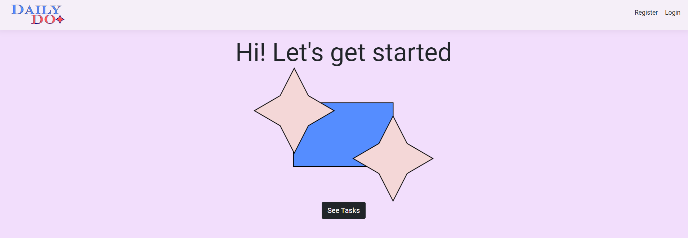
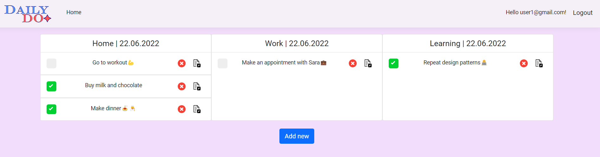
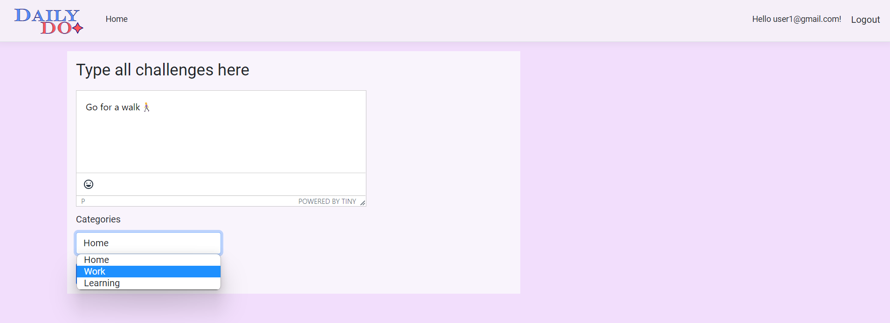
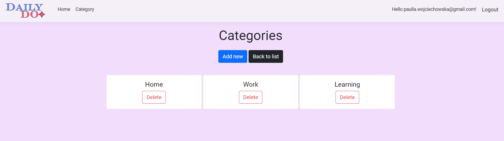
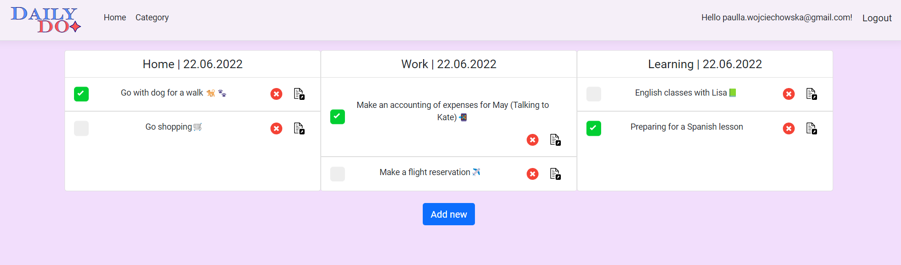

# DailyDo

Simple To-Do List 📝

## Description

DailyDo helps you stay on top of your current to-do tasks for the day.

There are two roles in the application- user(logged /not logged) or admin.
Each of them has different access privileges. A user has to register or logging in to start creating tasks. 

Only then he can add, edit, delete or display all his tasks for a day.

There are three categories of tasks to choose from by default.
Admin, in addition to acting on tasks, sees more options and can also add new or delete existing categories.

Users decide which category to assign the task when they create it. When they complete a task, they uncheck the appropriate checkbox.

## Built With
- .NET 6.0
- EF 6.0
- Bootstrap
- CKEditor
- JavaScript
- Inkscape

